  

<h3 align="center">miri-10</h3>

<!-- This bio is plain text -- edit it directly, no build step needed. -->
<blockquote>
this profile draws itself. no third-party stat cards, no widgets that 
can rate-limit or go dark -- every graphic below is generated by a 
script that lives in this repository.
</blockquote>

  

   
   
   
  

 

<samp>python &middot; github actions &middot; graphql &middot; svg + smil &middot; self-hosted fonts</samp>

stats refresh nightly via <a href=".github/workflows/refresh.yml">a scheduled action</a>
and make zero third-party requests. the portrait is generated once from a
photo -- see <a href="scripts/generate_portrait.py">scripts/generate_portrait.py</a>.

setup

 

1. **First run:** go to the *Actions* tab, open *refresh stats*, and click
   *Run workflow* once. That populates `stats.svg`, `streak.svg`,
   `langs.svg`, and `year.svg` with real numbers instead of the
   placeholders committed here. After that it runs nightly on its own.

2. **New portrait:** drop a well-lit, tightly-cropped headshot at
   `assets/headshot_source.jpg` and run:

   <samp>python3 scripts/generate_portrait.py assets/headshot_source.jpg portrait.svg</samp>

   First run downloads rembg's background-removal model (~176MB, cached
   after). If that download isn't reachable, the script falls back to an
   OpenCV GrabCut cutout automatically.

3. **New heading:** <samp>python3 scripts/generate_heading.py "label" assets/headings/label.svg</samp>

Fonts: DejaVu Sans Mono (Bitstream Vera License, see
<a href="assets/fonts/LICENSE.txt">assets/fonts/LICENSE.txt</a>) --
substituted for JetBrains Mono, which shares its 0.600em advance width, so
the character grid's geometry is unaffected. Portrait pipeline adapted from
the <a href="https://burly-handstand-0dc.notion.site/ASCII-Portrait-README-Guide-3a3e3f86338481f0b545ec8120bbf604">ASCII Portrait README Guide</a>.

